# MRP (Map → Reduce → Produce)

Agentic MRP runtime and compiler.

## Features

- YAML → IR compiler with deterministic seed and canonical ordering
- Local threadpool runner (maps → reduce → produce)
- Content-addressed artifacts (BLAKE3 over stable JSON)
- CLI: `mrp compile`, `mrp run`, `mrp replay` (stub)

```mermaid
graph LR
    subgraph "📋 Job Configuration"
        JOB["🧬 Biological data processing "]
    end
    
    subgraph "🗺️ MAP"
        AGENT["🤖 Agent: process_bi"]
        DATA1["📦 Shard 1<br/>[ATCG,GCTA,TGCA,CGAT,AATG]"]
        DATA2["📦 Shard 2<br/>[PROTEIN_A,ENZYME_B,RECEPTOR_C,KINASE_D]"]
        DATA3["📦 Shard 3<br/>[ATP,NADH,GLUCOSE,GLYCOGEN,LACTATE]"]
        DATA4["📦 Shard 4<br/>[HEMOGLOBIN,INSULIN,COLLAGEN,KERATIN]"]
    end
    
    subgraph "🔄 REDUCE"
        REDUCE["📊 stats<br/>Aggregate all results"]
    end
    
    subgraph "📤 PRODUCE "
        PRODUCE["📝 save_markdown<br/>Generate  report"]
        OUTPUT["📊 Final Report"]
    end
    
    JOB --> AGENT
    AGENT --> DATA1
    AGENT --> DATA2  
    AGENT --> DATA3
    AGENT --> DATA4
    DATA1 --> REDUCE
    DATA2 --> REDUCE
    DATA3 --> REDUCE
    DATA4 --> REDUCE
    REDUCE --> PRODUCE
    PRODUCE --> OUTPUT
```



### Requirements

- Python 3.12+

### Setup

```bash
python3 -m venv .venv
source .venv/bin/activate
pip install -e .
```

### Quickstart (compile → run)

```bash
# 1) Compile: emits IR + manifest + policy
mrp compile examples/jobs/toy.yaml
# prints COMPILE_DIGEST → inspect JSON
cat .mrp/artifacts/<COMPILE_DIGEST>.json

# 2) Run: executes the job, emits execution record
mrp run examples/jobs/toy.yaml
# prints RUN_DIGEST → inspect JSON
cat .mrp/artifacts/<RUN_DIGEST>.json
```

### Cloud sandbox (Daytona) usage

- Requirements: set `DAYTONA_API_KEY` in a `.env` at repo root (or env var).
- Behavior with `--backend cloud_sandbox`:
  - Map runs in Daytona sandboxes (one per shard)
  - Reduce runs locally (deterministic aggregation)
  - Produce runs locally

Examples:

```bash
# Pre-authored operators in cloud
mrp run examples/jobs/cloud_toy.yaml --backend cloud_sandbox
cat .mrp/artifacts/<RUN_DIGEST>.json

# Generated operators in cloud
mrp run examples/jobs/generated.yaml --backend cloud_sandbox
cat .mrp/artifacts/<RUN_DIGEST>.json
```

Outputs location:

- Producer outputs are saved under `.mrp/outputs/<job_id>/<timestamp>/`.
- The run artifact also includes `output_dir` pointing to this folder.

Cloud genomics demo (maps on sandbox, reduce/produce local):

```bash
mrp run examples/jobs/cloud_genomics.yaml --backend cloud_sandbox
# Find outputs using the run artifact:
cat .mrp/artifacts/<RUN_DIGEST>.json | jq -r .output_dir
ls $(cat .mrp/artifacts/<RUN_DIGEST>.json | jq -r .output_dir)
# Includes: analysis_report.md, genomics_analysis_plots.(png|pdf), analysis_summary.tsv, genomics_bins.csv, genomics_summary.txt
```

### Input (YAML) → Output (JSON)

- Input is a YAML job spec. Example (`examples/jobs/toy.yaml`):

```yaml
version: v0
job_id: toy-001
map:
  operator: "examples.toy:UppercaseAgent"
  shards:
    - { _shard_id: 0, text: "foo" }
    - { _shard_id: 1, text: "bar" }
reduce:
  operator: "examples.toy:ConcatReducer"
  config: { sep: "-" }
produce:
  operator: "examples.toy:JsonProducer"
  config: {}
```

- Compile produces a JSON artifact containing IR, manifest, and policy:

```bash
mrp compile examples/jobs/toy.yaml
# prints a digest like: 3038c2...a1
cat .mrp/artifacts/<COMPILE_DIGEST>.json
```

- Minimal shape of the compile artifact:

```json
{
  "ir": {
    "job_id": "toy-001",
    "operators": {
      "map": "examples.toy:UppercaseAgent",
      "reduce": "examples.toy:ConcatReducer",
      "produce": "examples.toy:JsonProducer"
    },
    "seed": "<deterministic-seed>"
  },
  "manifest": {
    "job_id": "toy-001",
    "operators": { "map": "...", "reduce": "...", "produce": "..." },
    "seed": "<deterministic-seed>"
  },
  "policy": {
    "status": "ok",
    "egress_allowed": false,
    "caps": { "workers": null, "time_s": null, "mem_mb": null }
  }
}
```

- Run produces a JSON artifact containing only the execution record:

```bash
mrp run examples/jobs/toy.yaml
# prints RUN_DIGEST
cat .mrp/artifacts/<RUN_DIGEST>.json
# => { "maps": [...], "reduce": {...}, "produce": {...} }
```

### Generated operators (codegen-ready)

- You can embed generated operators directly in the YAML via a `generated` block (no pre-existing module required). The compiler materializes the Python code under `.mrp/ops_pkg/` using a content digest and resolves the entrypoint automatically.

Example (`examples/jobs/generated.yaml`):

```yaml
version: v0
job_id: gen-001
map:
  generated:
    entrypoint: "ops.gc:GCContentAgent"
    code: |
      from typing import Dict, Any
      class GCContentAgent:
          def run(self, params: Dict[str, Any], seed: str) -> Dict[str, Any]:
              seq = params.get("seq", "").upper()
              g = seq.count("G"); c = seq.count("C")
              gc = (g + c) / max(len(seq), 1)
              return {"_shard_id": params.get("_shard_id", 0), "gc": gc}
  shards:
    - { _shard_id: 0, seq: "ATGC" }
    - { _shard_id: 1, seq: "GGGG" }
reduce:
  generated:
    entrypoint: "ops.reduce:AvgReducer"
    code: |
      from typing import Dict, Any, List
      class AvgReducer:
          def run(self, inputs: List[Dict[str, Any]], seed: str) -> Dict[str, Any]:
              vals = [x.get("gc", 0.0) for x in inputs]
              return {"avg_gc": (sum(vals) / max(len(vals), 1))}
produce:
  operator: "examples.toy:JsonProducer"
  config: {}
```

Compile and run:

```bash
mrp compile examples/jobs/generated.yaml
cat .mrp/artifacts/<COMPILE_DIGEST>.json

mrp run examples/jobs/generated.yaml
cat .mrp/artifacts/<RUN_DIGEST>.json
```

Notes:

- Generated code is saved under `.mrp/ops_pkg/gen_<digest>.py` and imported as `ops_pkg.gen_<digest>:Class`.
- Guardrails (determinism, no-egress default, resource caps roadmap) apply at compile/runtime.

### Testing

```bash
pip install pytest
pytest -q
```

### Layout

- `src/mrp/*`: compiler, IR, runtime, SDK, CLI, artifacts
- `src/mrp/runtime/backends/*`: cloud backends (e.g., Daytona `cloud_sandbox`)
- `src/examples/*`: example operators (`toy`, `genomics`)
- `examples/jobs/*`: example job specs (`cloud_toy.yaml`, `generated.yaml`, `cloud_genomics.yaml`)
- `.mrp/artifacts/*`: compile/run artifacts (JSON)
- `.mrp/ops_pkg/*`: materialized generated operator modules
- `.mrp/outputs/<job_id>/<timestamp>/*`: producer outputs (reports, plots, CSVs)
- `docs/mrp_PRD.md`, `docs/daytona_PRD.md`: plans and runbooks
