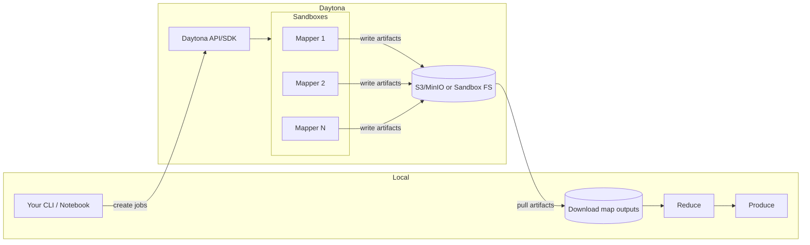

# Architecture

## Overview

```mermaid
flowchart LR
  subgraph Local
    CLI[Your CLI / Notebook]
    RED[Reduce]
    PROD[Produce]
    S3DL[(Download map outputs)]
  end

  subgraph Daytona
    API[Daytona API/SDK]
    subgraph Pool[Sandboxes]
      M1[Mapper 1]
      M2[Mapper 2]
      M3[Mapper N]
    end
    STORE[(S3/MinIO or Sandbox FS)]
  end

  CLI -->|create jobs| API
  API --> Pool
  M1 -->|write artifacts| STORE
  M2 -->|write artifacts| STORE
  M3 -->|write artifacts| STORE
  STORE -->|pull artifacts| S3DL
  S3DL --> RED --> PROD
```
